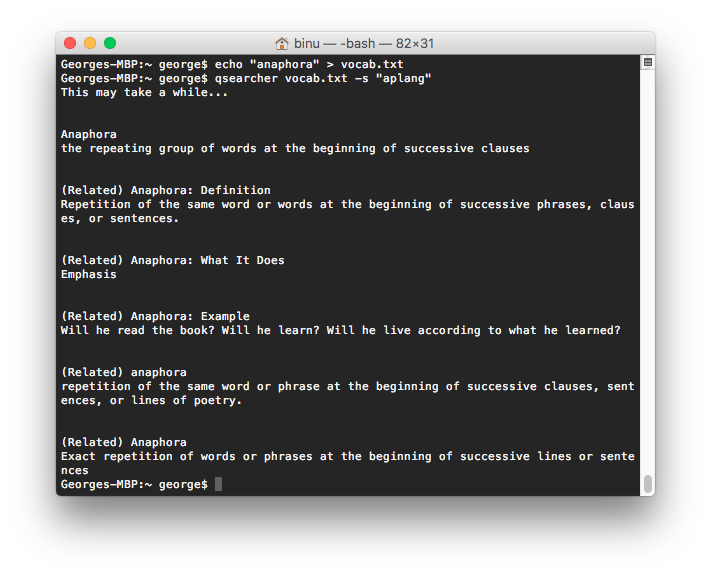

# qsearcher
[[Source]](https://github.com/geooot/qsearcher)  [[Website]](https://geooot.com/qsearcher)

Get vocab definitions from quizlet from an input file.
<p align="center">
	<a href="https://asciinema.org/a/9d2h61kxhb45by465ojzcgbl8"></a>
</p>


## Use case
Have an APUSH review to do? Put all the terms into a text file and we will get definitions for you from multiple quizlet sets.

## Install
```
npm install -g qsearcher
```
* Note: may require sudo

## Usage
```
Usage: qsearcher <file | searchTerm> [options]
Options:
	-s [search term] default: "apush"
	-j print out results in JSON format
example: qsearcher vocab.txt -s "history"
```
